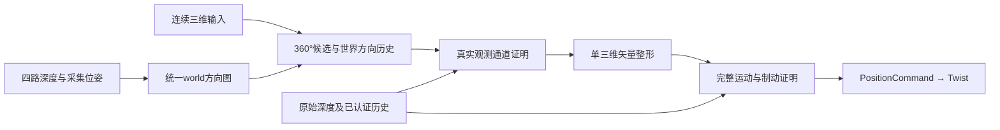

# EGO1P3 连续360°方向融合与对照验收

2026-10-07，v22实现及24轮冻结对照已完成。**指定连续扫向工况明显改善；“主要工况均不退步、全面优于EGO1P2”的严格验收未通过。** 两版固定目标均5/5安全到达，全部24轮扫掠重叠/外部保护均0。独立旋转的误差、进展和计算开销退化，固定目标平均用时也略慢；完整结果与所有失败保留，不使用探索最佳轮替代正式数据。

## 当前冻结结果（v22）

实现路径为四路光轴深度及各自采集位姿 → world球面方向图 → 统一世界方向候选 → 单三维矢量整形 → 完整运动/制动认证。
水平180列、俯仰37层，精确输入和上一世界方向额外参加候选；人工规划不再预选单个90°相机。
固定目标每周期维护各视图候选，精确目标方向已经获得真实通道证明时立即返回，绕障仍统一比较。
实际日志中的旧相机规划切换次数：扫向P2每轮5次、旋转14次、恢复6次；P3均0。
真实相机布局未变，接缝、近场和上下盲区仍须按未知处理，不能把“360°方向域”理解为无盲区传感器。

以下为全部冻结轮次均值；扫向/旋转各3对，恢复1对，固定目标5对。正负变化均保留。

| 指标 | EGO1P2 | EGO1P3 | 结论 |
|---|---:|---:|---|
| 扫向：运动方向误差 | 30.681° | 7.534° | 下降75.4% |
| 扫向：全部活动输入向量RMS误差 | .550m/s | .181m/s | 下降67.1% |
| 扫向：沿输入进展 | 21.136m | 28.413m | 增加34.4% |
| 扫向：有输入停车 | .717s | .250s | 减少65.1% |
| 扫向：jerk RMS | 4.894m/s³ | 2.302m/s³ | 降低53.0% |
| 旋转：运动方向误差 | 11.321° | 12.343° | 退化9.0% |
| 旋转：全部活动输入向量RMS误差 | .570m/s | .608m/s | 退化6.7% |
| 旋转：沿输入进展 | 92.044m | 89.796m | 减少2.4% |
| 旋转：有输入停车 | .500s | .494s | 基本相同，均无长停 |
| 旋转：jerk RMS | 3.161m/s³ | 3.735m/s³ | 退化18.1% |
| 固定目标：安全到达 | 5/5 | 5/5 | 本批均通过 |
| 固定目标：仿真到达均值±样本标准差 | 69.717±.923s | 70.143±1.267s | 慢.427s，波动增大 |
| 固定目标：墙钟到达均值 | 70.318s | 73.279s | 慢2.961s |
| 固定目标：有输入停车 | .240s | .250s | 多.010s，严格判据仍计失败 |
| 固定目标：jerk RMS | 2.108m/s³ | 2.011m/s³ | 降低4.6% |

恢复工况进展81.917→82.529m、停车1.250→1.233s；角误差6.621→6.874°、向量RMS .538→.541m/s，
仅各1轮，不能据此宣称统计显著改善。停车统计包含起步加速与反向起步，.010s等小差别接近一个仿真采样周期，
但没有事后放宽原严格门槛。旋转退化也不能被扫向收益抵消后隐去。

避障计算均值：扫向1.418→.363ms，旋转.611→1.359ms，恢复.875→1.123ms，固定目标.667→1.601ms。
P3旋转和固定目标各出现累计约.017s计算截止状态；固定目标计算峰值101.910ms，严格逐周期实时保证仍未通过。
完整p95、峰值、状态时长、所有逐轮结果和标准差见[完整数据表](performance/omni_20261006/final_v22_results.md)。

### 验证与恢复证据

- 主入口构建成功，CTest **22/22**；平台15/15及P2原CTest20/20在本任务早期通过，随后相应保护源码未改。
- 方向测试含721个半度扫向、独立射线/球真值、周期接缝、采集位姿/偏移、缺帧/过期/撤销/未知和真实走廊认证。
- 联合覆盖细分5→7、1024内部细分预算保持；六球解析覆盖回归在旧5层失败，在7层通过，真实2mm缺口仍拒绝。
  原机体.48m、认证.58m、速度2m/s、垂向1m/s、实际响应.22s与加减速度1.2m/s²不变。
- 21个旧核心状态中4个决定保持、17个原拒绝变为完整认证非零命令；v22重放程序与v21字节一致。
  快照缺少完整原始命中云和ROS前端时序，不能把新决定说成原现场复现，不能写成21/21决定相同。
- 最终v22 ROS探针通过缺前相机、未知机体、过期深度/输入及松手停车；合成探针没有起始自由邻域，全部零输出是预期拒绝，动态成功由24轮另证。
- 全部24轮独立.48m整段扫掠对原占据体素/地面重叠0、外部保护0，限速/加速度契约通过。EGO1P2原2922文件/3257条目无变化；125份冻结运行源码、二进制和24轮元数据全部一致。
- 19项运行文件的精确差异见[v22_diff_vs_EGO1P2.patch](performance/omni_20261006/v22_diff_vs_EGO1P2.patch)，冻结包在[v22_frozen](performance/omni_20261006/v22_frozen)。`paper_guidance.cpp`是明确的有意修改，其余8项安全/平台/场景保护文件未改。
- [机器验收判据](performance/omni_20261006/final_v22_acceptance.json)、[最终验证清单](performance/omni_20261006/final_v22_validation.json)、[完整性报告](performance/omni_20261006/final_v22_integrity.json)。
- [六项对照图](performance/omni_20261006/final_v22_comparison.png)、[首对人工轨迹示意](performance/omni_20261006/final_v22_trajectories.png)、[全部目标XY轨迹](performance/navigation_benchmark_20260929/omni_final_v22_trajectories.png)。目标图底图是低空占据投影，二维路线不能代替三维碰撞审计。

实际手柄、GUI/RViz完整负载、其他地图/起终点、动态障碍和真机均未验收；不保证所有状态不卡停或全域优胜。
主优化已解决单相机候选选择限制，并获得指定扫向的明显收益；若要求每项主要工况都优于P2，仍需解决旋转时的候选稳定性和目标计算开销，当前不应判为全部达标。
以下保留实现细节、预设协议、探索与失败历史；其中“进行中”等文字只代表当时状态。

## 问题与实现

EGO1P2控制输入本身已经是连续三维向量，四相机也同时参与后端安全证明；限制在候选生成：
`selectClosestYaw`按实测运动（静止时按意图）选一路90°深度图，过接缝会清空规划历史。
选中相机缺帧也会阻断其他有效视角；固定目标配置进一步只消费前相机。

EGO1P3默认新增`paper_omni_depth`：各相机的光轴深度先反投影为点，使用采集时刻插值位姿
和真实相机偏移转换到world，再平移到当前机体中心。水平180列（2°）、俯仰37层（5°）的
球面方向图统一融合障碍碰撞锥，方位首尾相连；精确输入向量和上一世界方向额外参加候选，
不量化空旷方向的连续输入。球面候选用透视归一化方向偏差、俯仰、历史方向及净空评分，经真实通道证明；
当前v18起固定目标每周期优先各有效视锥的原成熟局部候选生成器，将结果转换到world统一比较，
保留原子视图连通域/净空选择能力；v22在精确目标方向已获真实通道证明时跳过剩余绕障搜索。人工连续意图优先球面目标，仅无可认证方向时采用局部补充。每个子视图独立保存规划掩码，超过.3秒未使用即清除陈旧像素缓存。
这里不按最近相机预先选一路；整个视锥是否能产生正向候选由四角射线判定，相邻视角共同参与。
最终只输出一个三维向量，经原整形和完整运动/制动证明。球面预算先精查近邻，再分散搜索；
远前视失败可尝试同样由原认证器证明的短走廊。

方向图及可视化里的“有可见端点”只用于提案/诊断；它不是完整机体已知自由空间证明。
未知深度不填成远距离，缺失相机不补造深度，过期/未来/撤销观测不参与融合。
历史观测继续在原认证器中维护。v21起联合覆盖递归深度5→7、1024次细分预算保持；接受子盒仍须以包围球完整包含于真实证据，未证明即拒绝。认证包含关系、.48m机体/.58m包络、2m/s上限和1.2m/s²实际动力学不变。
四路水平相机仍存在近场和上下盲区；360°指水平方位的统一方向规划；带偏移的四个90°视锥在对角接缝也有近场观测缺口，不是完整球面传感器覆盖。

## 坐标与数据路径

像素深度采用相机光轴距离，不把它直接当球面射线长度：

```text
p_camera = z * [(u-cx)/fx, (v-cy)/fy, 1]
p_world  = camera_origin(t_capture) + R_world_camera(t_capture) * p_camera
r        = p_world - vehicle_position(t_control)
azimuth  = atan2(r_y, r_x)                  # modulo 2π
elevation = atan2(r_z, hypot(r_x, r_y))
```

每个相机分别使用自己的采集位姿；不假设四路同时曝光，也不把四个速度向量相加。
对障碍点建立包含机体包络和粗像素横向尺寸的方向碰撞锥，取每条射线的最近进入距离。
前视沿用原策略的速度×规划时间＋时延距离＋制动距离＋0.35m形式，并限制到量程/终点。
当前v22候选前视制动参数与P2同为2.5m/s²；两版**最终运动认证**都用实际1.2。
早期v4–v10曾使用1.2作为候选前视，这些探索记录原样保留，不混入最终冻结成绩。
球面碰撞锥包含额外粗像素横向覆盖，原局部候选沿用.58m包络；两者都是提案，
不能替代原保守深度/原始命中矛盾检查与完整机体通道证明。
用周期邻接关系计算角域净空，候选成本比较与输入、上次方向的夹角以及俯仰变化。
精确输入可经原认证器直接提出；球面远候选要求前视端点有当前观测，
短走廊恢复与成熟局部候选则由真实观测/已认证历史证明，不因球面图无命中就授权未知。
方向保留使用原.35秒窗口，每次重新证明；人工输入累计改变>.05rad撤销窗口，
固定目标的自然指向变化沿用原目标保持语义。
候选与最终运动两次认证的职责不同，不能用端点可见或碰撞锥图替代完整制动检查。



## 对照协议

- 原4倍Cloud、原地图及机体；两算法运行同一EGO1P3主Shell/Isaac执行器，分别加载各自原生launch和二进制。
- EGO1P2源码及二进制不改，运行成果写入EGO1P3，避免污染基线。每轮记录输入、场景、二进制及launch的SHA256。
- `sweep`：40秒，固定机头，.8m/s世界输入以每.2秒2°扫过整圈。
- `spin`：64秒，世界输入(1.8,.2,0)，机体独立以.35rad/s旋转；停车后反向返回并逆向转头。
- `recovery`：原72秒独立航向/侧移/升降/松手恢复轨迹。
- 冻结版本后sweep、spin各3轮，交替运行顺序。不得将探索轮混入冻结组，不删失败。
- 主目标：扫向和旋转工况的平均运动方向误差、全部活动输入下的速度向量RMS误差降低；
  有输入停车不增加、实际沿输入投影进展不降低。方向误差必须结合进展解释，不能靠停车改善。
- 安全硬条件：每轮完整.48m包络扫掠重叠=0、外部保护=0；限速/制动契约保持。
- 报告jerk和计算均值/p95/峰值的全部变化，不要求隐去计算开销；原固定目标协议另行检查回归。
- 脚本输入不是实际用户摇杆录制，结果只支持本场景和指定轨迹；不宣称跨地图、真机或任意状态优胜。

## 复现方法与版本边界

日常构建/运行仍只使用README中的两个主Shell入口；以下Python驱动用于重复对照，内部调用相同主运行入口。
需先保存两个项目各自原生构建产物；P3的`FOV_GVF_OMNI_DEPTH=0`只关闭新候选前端，仍使用P3的7层联合证明，
**不是完整的EGO1P2基线**。正式对比加载`/tmp/fov_gvf_ego1p2_isaac_install`中的原生P2二进制与launch。
每个新实验应使用唯一标签，不覆盖`final_v22`或其他历史结果；所有Isaac试验顺序占用共享锁，RViz关闭。

```bash
cd /home/starry/isaac-data/EGO1P3
export PYTHONNOUSERSITE=1
/usr/bin/python3 tools/run_omni_comparison.py new_comparison --case sweep --repeats 3
/usr/bin/python3 tools/run_omni_comparison.py new_comparison --case spin --repeats 3
/usr/bin/python3 tools/run_omni_comparison.py new_comparison --case recovery --repeats 1
/usr/bin/python3 tools/analyze_omni_comparison.py new_comparison
/usr/bin/python3 tools/run_navigation_benchmark.py omni_new_comparison ego1p2 ego1p3 --repeats 5
/usr/bin/python3 tools/analyze_navigation_benchmark.py omni_new_comparison
/usr/bin/python3 performance/omni_20261006/summarize_acceptance.py new_comparison
```

冻结包`performance/omni_20261006/v22_frozen`含125份运行源码、SHA清单及控制器/核心重放程序。
`v22_diff_vs_EGO1P2.patch`记录相对复制来源的19项运行文件变化，不使用继承Git HEAD代替复制基线。
更换ROS/Isaac或重新构建可能改变二进制；新结果必须记录自己的哈希，不能借用旧冻结证据。

## 探索记录

1. v1 sweep：两版安全审计均0；P2/P3平均角误差28.722/5.262°，停车.900/.250s，投影进展21.681/28.871m。
   v1全量栅格每周期计算，均值1.277/1.960ms；加入精确直行通过时跳过栅格的快速路径成为v2。
2. v2 spin（文件名保留explore_v1，二进制SHA记录实际版本）：出现候选反复检查相邻方向、侧向通道未入预算；
   P3停车20.9s、最长9.667s、路程39.464m，远差于P2的.5s/98.338m。两版安全审计仍0，**明确失败**。
   frame_6显示朝意图可认证前缀约1cm，而较侧向仍有通道；扩大方向分布并提高多余俯仰代价后进入v3重测。

3. v3扩大候选角度分布后，spin停车5.8s/最长.7s，仍明显不如P2；避障峰值1135.383ms，保留失败。
4. v4恢复原前视量并加入周期角域净空：spin停车.5s/最长.25s，无计算截止，平均角误差11.243°，
   仍略差于P2探索轮10.682°；固定目标单轮安全到达69.983s，jerk1.956，非冻结比较。
5. v5将未观测前视端点排除出绕障候选，缩小无用堆搜索：spin停车.5s，平均误差10.930°，
   计算均值2.333ms，仍未确认优于P2。精确操作者输入可以使用原有已认证历史/起始邻域，
   但自动绕障目标不因球面图无障碍点就把上下盲区当成远处开阔通道。
6. v6保留完整前视，将角域净空奖励0.55降至0.25rad⁻¹、奖励上限0.4降至0.3rad；
   目的是减少宽通道内不必要的偏离，不改变安全半径/证明。正在重测sweep和spin。

7. v6 spin较v5退化：停车.683s、投影进展86.913m、jerk4.005、计算截止2次；虽平均角误差下降，
   不能据此宣称更好。已撤回v6的奖励参数，冻结v5算法用于最终交错重复。v6全部成果保留。

## v5历史冻结验收说明

当时冻结使用v5算法，不将探索轮纳入统计。sweep/spin各3轮，用各工况独立结果和整体360°任务收益共同判断；
任何单项退化必须列出，不能将“360°任务整体改善”写成“所有工况/所有指标全面领先”。
另执行原recovery输入和原固定目标协议回归。当前运行中，未先行写为通过。

## v5冻结组未通过稳定性验收，继续修正

完整sweep三对均安全，平均误差30.385→8.064°，停车.811→.250s；但spin第三轮P3停车3.017s/最长2.517s，
COMPUTE_DEADLINE累计2.45s，因此不能将前两轮结果当完整通过。recovery照常结束后取消尚未开始的
固定目标五轮；父进程被显式STOP后TERM/CONT终止，仅作用于本任务测试进程，未中断当前仿真。
后续v7保留失败组，增强对多余升降的代价，并把**候选前视**制动项恢复P2原2.5m/s²以便同条件比较；
原走廊与最终运动证明始终使用实际1.2m/s²，不改变真实安全能力。

## v7退化与v8机制修复（进行中）

v7三轮spin全部安全，但平均方向误差13.260°、投影进展85.504m、停车1.083s，未胜出。
v8恢复v5的前视制动1.2与俯仰代价1；新增先精查8个相邻候选，再分散搜索；长前视仅使用
3/4认证预算，失败后检查几何净距至少为当前制动走廊的短候选，仍由原真实观测认证整条走廊，
最终完整运动证明不变。短候选不要求遥远端点可见，也不把未知填成自由空间。
新增4°窄通道回归先在v7明确失败，v8核心21/21通过；新增真实证据短走廊起步回归通过。
三轮v8实跑正在执行，共享Isaac锁为批处理可选等待，日常运行保持原有单实例拒绝行为。

更正上一节“固定目标尚未开始”：停止批次后子进程实际已开始一轮P2并独立完成，
`omni_final_v5_ego1p2_1.json`为ARRIVED 72.1167s；其父驱动退出143，缺少正常补写的退出码。
该孤立轮保留，不纳入后续正式五轮成对比较，原计划余下九轮未执行。

## v8结果与v9冻结（进行中）

v8旋转三轮全部安全，平均方向误差10.539°、投影进展90.240m、停车.722s，第二轮停车1.167s，
仍未通过。v9保留其近邻/短走廊机制，将多余俯仰代价从1提高到4，并恢复P2已存在的
`paper_intent_corridor`直达回归：原认证器证明“当前制动走廊 + max(速度,输入速度)×(2τ+.5)”
后，优先使用精确输入方向。该配置此前未接入新的全向分支，现两种前端一致执行。
v9经主build构建，核心21/21通过。源码、二进制和SHA冻结于`v9_frozen/`，随后开始
`final_v9`三轮旋转交错比较；结果未提前写为通过。

### v9配置核对更正

源码存在`paper_intent_corridor`，但EGO1P2和EGO1P3主launch当前默认都为false。
因此v9补齐的是可选分支兼容性，正式默认运行尚未启用，不能把它解释为已恢复的默认行为。
v9相对v8实际启用的算法变化为俯仰偏差附加权重1→4；前视保持v5的实际1.2制动。
冻结包包含真实launch和SHA，结果按此真实配置解读。

## v9、v10失败结论与v11参数对齐

v9三对旋转完整结束，两版每轮均停车.5s、最长.25s、安全审计0；但P2/P3平均方向误差
10.607/11.551°，速度向量RMS .551/.610m/s，投影进展92.385/89.420m，P3未胜出。
v10只在全向分支启用原有直达走廊认证开关：旋转单轮方向误差12.848°、停车.917s、进展
84.196m、计算截止2次，固定目标单轮75.233s到达且安全审计通过，亦退化，已撤回开关。
v11对齐P2候选前视的2.5m/s²参数（实际完整安全认证始终1.2），连续性取既有
config.hysteresis_weight=.4（此前全向默认.12），俯仰附加权重恢复1。核心21/21通过，旋转探索中。
因此不能把前面任何探索或失败冻结组当成最终优胜。

## v11、v12探索与v13稳定性补齐

v11旋转单轮安全，停车.5s，平均方向误差10.031°、向量RMS .544m/s、投影进展92.062m；
比最近P2三轮均值的92.385m仍略少，尚未确认胜出。
v12去掉候选层额外粗像素膨胀（完整证据/认证半径不改），旋转误差10.319°、RMS .519m/s、
进展91.851m、停车.5s；固定目标73.683s安全到达，但停车1.233s、jerk3.477，故撤回该几何修改。
v13恢复v11几何，并补齐原配置的.35秒已选方向保留：每次重新做几何/通道证明，
输入累计变化超过.05rad立即取消保留，直达方向安全时仍优先精确输入。
新增保留与过期回归，核心21/21通过；真实ROS探针增加--omni和缺失前相机验证。
当前动态运行受已有共享Isaac锁排队，未与其他仿真并发。

## v13结果与v14透视代价校正

v13旋转单轮均角误差10.667°、RMS .543m/s、进展91.995m、停车.5s，jerk2.977；
固定目标77.083s安全到达、停车.25s、jerk2.028，仍有绕行/低速损失，不能写成优胜。
v14把线性增长偏弱的角度平方成本改为截断tan(angle)平方，保持小角连续和大角惩罚；
不再用更多净空奖励大幅偏离。已认证保留方向提前返回，避免无用栅格与Dijkstra。
核心21/21通过；旋转单轮角误差10.003°、RMS .539m/s、进展92.181m、停车.5s、
均计算1.072ms、无计算截止、安全审计0。固定目标及新P2基线排队比较，非冻结成绩。
真实ROS --omni探针通过：前相机缺失后3路进入认证，全部未观测机体输入仍拒绝；
过期深度为WAITING_OMNI_DEPTH、过期输入STALE_INTENT、松手ZERO_INTENT。日志已归档。

## v15/v16：世界候选池与最终冻结

v14固定目标73.200s，当前P2探索基线69.300s，未胜出。
v15加入多视角局部候选，旋转进展91.297m、均角误差13.044°，虽无长停仍未胜出。
v16修正参与视锥判定为四角完整覆盖（不能仅以光轴与输入夹角筛选），清除超过.3秒未使用的
局部像素掩码；局部重设阈值沿用原.5°、球面2°，固定目标不因反馈指向自然变化清掉保留窗口。
主build和核心21/21通过。探索固定目标69.183s安全到达、停车.25s、jerk1.676；
旋转角误差10.011°、RMS .530m/s、进展92.018m、停车.5s、jerk2.737、平均计算2.102ms，
两项安全审计均0。以上只是探索，不能替代正式结果。

2026-10-07冻结`v16_frozen/`：124份源码清单、完整源码包、控制器/重放二进制及SHA。
`final_v16`按上文协议执行sweep/spin各3对、recovery1对；`omni_final_v16`固定目标各5轮，
所有轮次交错、共享锁串行，最终同时报告原严格逐工况判据及每项实际变化，不删退化。

## v16正式失败与v17修正

v16完整sweep三对已完成，P3停车4.333/4.150/4.433秒，最长1.500/2.633/2.900秒；
虽然安全审计为0，明显未通过。原因是成熟局部候选在连续人工改向中覆盖了球面目标，
不能把固定目标的收益直接推广到人工控制。后续尚未开始的spin/recovery/五轮目标组已取消，
仅暂停/终止本任务父批次，完整当前子组仍保留；父进程退出143。
v17人工优先连续球面候选，球面无认证方向才调用局部恢复；固定目标优先策略保持v16。
探索sweep误差7.441°、RMS .179m/s、进展28.432m、停车.25s、jerk2.293、安全审计0。
主build/核心21/21通过，124份源码及二进制冻结在`v17_frozen/`，重新执行完整`final_v17`协议。

## v17完整失败结论与v18修正

v17严格验收失败；v18修正已写入，待构建与动态比较。
- 目的：用户要求比EGO1P2更优；不能把人工扫向显著改善替代固定目标失败。
- 项目路径：`/home/starry/isaac-data/EGO1P3`。
- 涉及文件：depth_angular_controller_node.cpp、README.md、OMNI_ACCEPTANCE.md、EGO1P3_VERSION.md、WORK_LOG.md；performance/omni_20261006下的报告/一致性脚本与全部final_v17证据；HISTORY/CHANGELOG.md。
- 修改内容：固定目标每周期优先四视角world局部候选池，保持各视图掩码更新/选择连续性；候选池无解才使用球面恢复。人工模式保留v17球面优先策略。真实证据、完整运动/制动证明、机体与限速不变。
- v17验证：主build/核心21/21，冻结源码124份/二进制一致性、EGO1P2完整2922文件未改、九个安全/平台/场景文件未改均通过；真实ROS --omni缺前相机/未知拒绝/过期/松手通过。24轮运行均退出0、全部扫掠重叠/外部保护0、速度/实际加速度契约通过，但固定目标只有4/5安全到达，不能写成全部任务成功。
- v17人工比较：扫向P2→P3均角误差31.705→7.580°，RMS .567→.182m/s，进展20.684→28.407m，停车1.011→.250s；旋转均角10.729→9.992°，进展92.309→91.869m退步，jerk3.029→3.833退步，两版停车.5s。恢复单轮停车2.15→1.25s、安全审计0。
- v17目标比较：P2 5/5、70.953±.934s；P3 4/5，成功均值71.092±1.939s、含失败104.873s、平均停车35.68s。第三轮在(50.087,12.233,1.857)机体包络未知而停到240s；回放audit证实.58包络拒绝，表面稀疏采样全覆盖不能替代完整证明。并未证明候选切换是唯一原因；v18是针对可见策略差异的修正，须重测。
- 其他记录：新增完整判据/逐轮表格/源文件核验脚本；图表第一次以未隔离Python运行因用户NumPy2与系统matplotlib ABI冲突失败，改用项目规定PYTHONNOUSERSITE=1 /usr/bin/python3后生成成功，无依赖安装或降级。报告区分成功轮到达均值与超时惩罚，所有失败保留。
- 回滚/备份：v17_frozen含源码包和二进制；final_v17_results.md/acceptance.json/integrity.json完整保留，未混入探索轮；旧validation_notes.json仅代表v5，不改成当前成绩。无提交推送。
- 后续事项：主入口构建v18，先固定目标探索，失败不得删去；随后决定冻结比较范围。真实手柄、GUI/RViz性能、跨场景和真机未验收。


## v21：联合证据完整覆盖的保守拒绝反例

离线反例已证实；解析回归及v21主构建/全套回归进行中，尚未动态验收。
- 目的：解决360°融合后多个真实观测联合覆盖机体却被有限层次包围球近似拒绝的可复现机制。
- 项目路径：`/home/starry/isaac-data/EGO1P3`。
- 涉及文件：src/pc_gvf/src/paper_guidance.cpp、src/pc_gvf/test/cpp/union_refinement_check.cpp、src/pc_gvf/CMakeLists.txt；版本/验收/工作日志及HISTORY/CHANGELOG.md；performance/omni_20261006下影子诊断脚本、结果、失败快照审计与v18目标五轮证据。
- v18正式结果：新旧均5/5安全到达、扫掠重叠/外部保护0；P2/P3均耗时69.283±.042/71.390±1.799s、墙钟69.303/74.567s、停车.237/.250s、jerk1.950/2.094，性能未胜出。因已有明确拒绝反例，v18人工正式组尚未开始，不能写成24轮完整比较。10轮元数据与124份冻结源一致性保留于v18_goal_integrity.json。
- 离线定位：仅复制冻结v17的核心源到/tmp/ego1p3_union_cert_diagnostic，建立从未安装/连接ROS的影子重放程序；编译和回放在共享锁下执行，不改变正在运行的正式组源码/二进制。原失败快照：5层/1024预算和5层/8192均拒绝，6层/1024仍拒绝；7层/1024证明.58m及+.01m余量，输出完整认证非零命令；8层额外开销更高。五次含进程启动/加载的重放墙钟中位5层约3.86ms、7层6.93ms、8层15.80ms，不能当在线控制计算时延。
- 解析反例：六个轴向已知球联合，完整覆盖半径R所需球半径可解析计算为max(d,sqrt(R²+d²-2Rd/sqrt(3)))；+8mm余量在5层拒绝、7层通过，-2mm真实薄缺口在5/7/8层始终拒绝。新增C++测试覆盖平移不变性、完整机体覆盖、薄缺口、缺失扇区、全未知及未知运动拒绝；先在旧核心证明测试失败，再改深度。
- 修改内容：仅把envelopeKnownImpl递归深度上限5→7，原1024次内部细分预算保持不变；所有被接受的盒子仍须由包围球完全包含于原真实证据，不使用表面采样授权。原先浅层已能证明的查询不增加递归。候选恢复v18，机体/认证半径、速度/动力学、保守深度/原始命中检查、未知拒绝、重放格式V18保持。
- 安全边界：本轮开始有意改变paper_guidance.cpp的证明精细度，不能继续说“安全核心文件未改”；认证包含关系和包络没有放宽。旧9文件完整性中此文件须列为明确修改，其余8项继续逐SHA核对。离线快照没有完整原始命中点与前端时序，证明改进不替代新实跑。
- 诊断失败：合成诊断首次把audit当stdout读取（实际写stderr），汇总IndexError；首次日志保留，合并stdout/stderr后重新汇总通过。不是核心验收通过的替代品。
- 回滚/备份：v17_frozen、v18_frozen、影子源/程序和解析诊断全部保留；恢复depth上限5并主入口重建可撤回此修正，无提交推送。
- 后续事项：完成先失败后通过的22项回归、重新分类旧快照变化、候选实跑及最终冻结成对比较。

