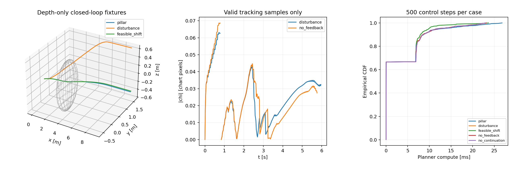

# EGO1P1 论文方法验收 — 2026-09-24（继续实现后）

> 本文是2026-09-24验收快照；2026-09-28修改了机体半径、证据保存与前视下限，当前版本请看 [ENVELOPE_ACCEPTANCE.md](ENVELOPE_ACCEPTANCE.md)。旧结果不能当作新参数的验收。

**静态 Cloud 的起步、三维规划与绕障运动已通过本轮有界场景验收；完整论文复现尚未全部通过。**
当前版本不再因为四水平相机的近场盲区一直停车。用户已批准一次性的场景几何起点认证；
新增未知空间仍拒绝进入。名义50Hz计时器在实际复杂场景尚有更新延迟，理论全域条件和实物实验未验证。
旧失败报告保留于 [previous_acceptance.md](performance/paper_completion_20260924/previous_acceptance.md)。

## 本轮完成的顺序

| 阶段 | 当前实现 | 验收 |
|---|---|---|
| 起始自由域 | 核对默认USD/occupancy的SHA-256并检验一个固定世界坐标2.5m球；只初始化一次 | 正/反几何例、错误来源、一次初始化测试通过；关闭后实际Isaac拒绝运动 |
| 深度自由体积 | 精确未知锥距离、胶囊覆盖、多视图/历史并集、真实命中撤销、静态已到达空间 | 保守包含正反例、过期/回退/不同相机乱序、无法凭空扩张、障碍撤销测试通过 |
| 规则方向场 | 粗细调和场、连续实际状态认证、C2势场重建、C1流场、可行前视、自适应方向图 | 立柱闭环从旧版约2m停车改善为9.28m前进，出现有效TRACKING样本 |
| 锚定与反馈 | 等势截面返回、chi/J反馈、参考折线投影延续、有效跳变/J范数/离散执行偏差诊断 | 解析直场/曲场收敛、J·u、换图/改向/延续及动态夹具通过；不等于连续理论证明 |
| 执行与实时性 | 单一三维矢量、统一运动模型、完整制动预测、80ms计算期限、两级100ms指令超时 | 实际运动/松杆停车通过；并行优化后约47Hz，未满足所有周期20ms |

实现细节及论文式1–31对应见 [PAPER_IMPLEMENTATION.md](PAPER_IMPLEMENTATION.md)。

## 构建、数值和ROS检查

证据目录：[performance/paper_completion_20260924](performance/paper_completion_20260924)。

| 项目 | 最终结果 |
|---|---|
| 主构建脚本 | build33，三个ROS包成功；使用现有OpenSSL/OpenMP，未安装或变更第三方版本 |
| CTest | **13/13通过**（paper-final-ctest.log）；保留此前11/12失败，没有将失败项跳过或改成预期失败 |
| 平台pytest | **15/15通过**；包含三维方向整体缩放与指令时戳拒绝检查；制动距离另由CTest检查 |
| ROS真实控制节点探针 | 无种子机载包络、过期深度/输入、视野外与松杆均正确拒绝/发零；这是拒绝契约，不冒充非零运动验收 |
| 深度数据契约 | 四路320×240原始图中19,163个+Inf像素逐条精确DDA核查，10m内真实场景命中0；NaN/零/负无穷仍未知 |
| 静态检查 | 两主脚本bash -n、相关Python语法、git diff --check；结果见最终日志 |

深度检查只验证当前理想Isaac渲染器、已知场景、已捕获起点样本与轴向10m契约的一致性。
不能由单次捕获推导任意实物相机或任意场景的无返回可靠性。离线DDA不向运行控制器提供自由空间。

## 独立闭环与消融

九个场景各500步、10秒；独立球障碍真值，不使用外部ESDF保护。相机在机体后方2m，是数值方法
夹具，不能替代下面的实际四机载相机验收。输出见closed_loop.csv和对应日志。

| 场景 | 最终位置(m) | TRACKING步数 | 参考延续/重置 | 最小机体净间距(m) |
|---|---|---:|---:|---:|
| 空旷 | (9.567,0,0) | 0 | 166/1 | 无障碍 |
| 立柱 | (9.279,1.574,-0.433) | 75 | 160/7 | 0.474 |
| 横向扰动 | (9.248,1.550,0.654) | 297 | 160/7 | 0.502 |
| 障碍侵入安全包络 | (2.735,1.110,-0.323) | 72 | 49/1 | 0.124 |
| 可行环境变化 | (9.275,1.608,-0.426) | 72 | 160/7 | 0.681 |
| 指令改向 | (4.263,4.724,0) | 0 | 149/5 | 无障碍 |
| 关闭横向反馈 | (9.258,1.560,0.553) | 287 | 160/7 | 0.496 |
| 关闭参考延续 | (9.257,1.560,0.553) | 287 | 0/167 | 0.496 |
| 单层场 | (9.297,1.288,0.932) | 10 | 165/2 | 0.449 |

九场景碰撞计数均为0。障碍突入行的期望结果是制动停车，**不是成功穿过动态障碍**；该瞬移事件
侵入了规划余量，不能证明对任意运动障碍的安全性。可行变化行则继续前进。
解析固定场中chi一秒内直场3→1.0981、曲场3.08273→1.12845，无反馈对照保留至少98%初始误差。
动态消融现在有有效跟踪样本，但不同重置/参考改变chi的坐标定义，不能以原始最大chi较小直接
宣称一种方法优于另一种。尚无统计意义的多种子基线排名。



## 实际Isaac四相机运行

四个相机仍为90°、320×240；未增加相机或改场景。起点(-64,-11.2,2.8)。
1m/s向前输入在1–26秒有效，29秒结束；至少向前8m、保护介入0、控制节点正常退出作为本轮
前进判据，TIMEOUT本身不算通过。位置与命令来自真实主入口，数值夹具不参与控制。

| 运行 | 向前进展 | 外部碰撞保护 | 实际指令Hz(仿真/墙钟) | 计算期限状态转入 |
|---|---:|---:|---:|---:|
| build31首次 | 16.419m | 0 | 29.45/30.69 | 有 |
| build31重复 | 16.676m | 0 | 30.72/29.64 | 36 |
| build32并行方向认证 | 16.551m | 0 | 40.97/38.12 | 0 |
| **最终build33** | **17.519m** | **0** | **46.97/47.86** | **0** |

最终1m/s运行终点(-46.481,-8.481,1.186)，位移17.802m。避障计算均值3.817ms、P95 19.331ms、
最大35.209ms；完整回调到发布P95 32.011ms、最大47.035ms。不同负载/深度时序导致轨迹差异，
这些重复不是严格相同传感数据的确定性重放。外部保护未介入只支持这些轨迹没有被该保护阻断，
不是全场景碰撞概率为零的证明。状态转入次数不是超时帧数。

最终同版本的补充运行：

- **2m/s输入上限**（1–21秒输入，24秒结束）：前进19.608m，终点(-44.392,-9.710,1.667)，
  外部保护介入0，计算期限状态转入0，指令43.37/42.99Hz；回调P95 40.960ms、最大65.820ms。
  这是输入上限测试，实际规划速度会减小，不表示全程以2m/s飞行。
- **三维改向+横向速度扰动**：t=5s位置(-60.49,-10.48,3.16)，正在执行(1.00,0.16,0.10)三维矢量；
  t=9s松杆，t=10s命令为零且手动输入已释放。终点(-57.510,-9.663,2.258)，外部保护0。
  原始JSON在t=3s注入(0,0.2,0)m/s速度扰动；不引入额外路径控制器。
- **关闭几何起点认证**：6秒终点仍为(-64,-11.2,2.8)，UNOBSERVED_BODY_ENVELOPE、命令为零，
  外部保护0。50Hz在这个提前拒绝场景达成，不能据此宣称绕障50Hz通过。

## 仍未满足的论文级条件

1. **全部控制周期20ms内完成**：复杂运行实际约43–47Hz，偶有较长周期；不能称为50Hz硬实时。
2. **表I参数完全一致**：表格用米制网格/截面，正文用图像方向坐标，未给出转换。本实现采用
   明确像素参数，场更新最小间隔100ms，表I为50ms；完整参数差异见实现说明。
3. **连续理论全域证明**：离散Laplace/C2插值、有限步长返回/J差分、离散自由掩码均是近似；
   有效截面上的2R界和有限样本诊断不证明全部公共域、执行扰动界和ISS假设成立。
4. **完整论文实验**：原稿实验小节仍空白，当前补充了有界数值/Isaac实验和消融；未做真实无人机、
   Unitree B2/G1或独立基线的大规模统计比较。当前静态历史证据配置不承诺任意动态场景安全。

因此可以开始使用当前主线做静态Cloud方向引导实验；不能写“完全复现论文全部内容”。

## 失败留痕与复现

[中间实验索引](performance/paper_completion_20260924/experiments/README.md)列出停滞、编译失败、
旧二进制误运行、依赖隔离问题及曾经142次外部保护介入的失败。旧报告和原始日志保留。
退出偶有Isaac/ROS rosout context invalid告警，控制和桥节点正常退出；不将其隐去。

在EGO1P1根目录执行：

```bash
bash scripts/build_isaac_ros_workspace.sh
export PYTHONNOUSERSITE=1
source /opt/ros/humble/setup.bash
source /tmp/fov_gvf_ego1p1_isaac_install/setup.bash
ctest --test-dir /tmp/fov_gvf_ego1p1_isaac_build/pc_gvf --output-on-failure
/usr/bin/python3 -m pytest -q src/pc_gvf_platforms/test
ROS_DOMAIN_ID=83 ROS_LOCALHOST_ONLY=1 /usr/bin/python3 tools/ros_vector_guidance_probe.py --paper
/usr/bin/python3 tools/validate_isaac_depth_contract.py performance/paper_completion_20260924/isaac_start_depth.npz
ISAAC_MANUAL_INPUT_MODE=trace ISAAC_HEADLESS=1 FOV_GVF_RVIZ=false ROS_DOMAIN_ID=84 \
ISAAC_INTENT_TRACE="$PWD/src/pc_gvf/test/fixtures/paper/isaac_verified_motion_trace.json" \
ISAAC_MANUAL_TIMEOUT=29 bash scripts/run_isaac_fov_gvf_navigation.sh > /tmp/paper-reproduce.log 2>&1
/usr/bin/python3 tools/analyze_paper_isaac_run.py /tmp/paper-reproduce.log
```

2m/s输入使用isaac_max_speed_trace.json和24秒超时；三维扰动使用isaac_intent_trace.json和12秒超时；
无种子检查使用FOV_GVF_VERIFIED_START=0、isaac_strict_observation_trace.json和6秒超时。
程序正向进展检查与20ms检查分别报告，不能将前者的退出0理解为所有论文指标通过。

本轮只改EGO1P1及HISTORY记录，EGO1P0和其他项目不变，未提交或推送GitHub。修改前快照：
`/home/starry/isaac-data/备份/EGO1P1_before_geometry_refinement_20260924_155516`。
