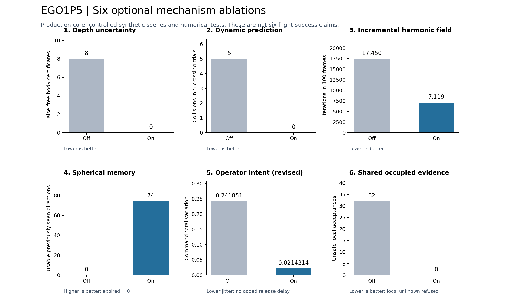
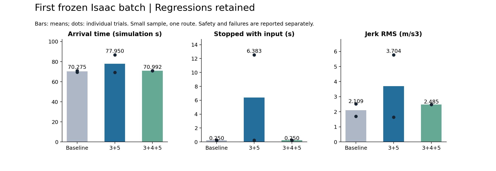

# EGO1P5 六方向优化与逐项验收

2026-10-07 22:31 — **EGO1P5完成新一轮六项局部优化和34条Isaac验证，整体全面优胜仍未通过。** 深度处理耗时下降约40–46%、密集动态关联253.118→41.248ms、增量场69.597→46.539ms、球面缓存维护162.603→110.487ms、意图微扰jerk下降约66.8%，共享容量满时危险误放行32→0；这些各有冻结旧/新模块消融。另修复执行向量和接收时间来自不同订阅的问题，同控制器③⑤开启时三对手柄实际jerk4.532→4.463、停车1.033→.967s；目标均值71.322→70.756s但停车/波动退化。默认启用绑定样本执行源，六项算法开关仍均关闭。核心31/31、平台15/15、执行样本39/39及64组合重放通过；本轮34条扫掠重叠/外部保护0，P3/P4保护源码未改。原始滤波整机退化、关闭阶段异常与所有旧记录保留；未提交推送。详见[本轮继续优化报告](SIX_AXIS_REFINEMENT.md)及[机器汇总](performance/six_axis_refinement_20261007/completion_summary.json)。下方为历史记录。

本任务以2026-10-07启动时的P5（P3 v22完整副本）为基线。来源P3/P4保持独立；复用P4模块必须重新在P5融合链上编译和消融。基线完整源码、二进制及哈希见 `performance/six_axis_20261007/baseline/`。本文随各阶段追加实际结果，不把计划写成通过。

**最终状态（2026-10-07）：六项方案、实现和逐项消融已完成；整体运行全面优于修改前的验收未通过。** 共18次固定目标安全到达、12次手柄等效轨迹通过完整机体扫掠审计，重叠和外部保护介入均为0。最终核心31/31、平台15/15、64种组合重放通过。默认六项全部关闭，使用本任务已实测的P5基线配置；按场景需要独立开启实验能力。不能把解析主指标改善推广成真实导航、主观体验或任意环境安全保证。

完整机器汇总：[completion_summary.json](performance/six_axis_20261007/completion_summary.json)。最终构建/机制结果/原版本重放/默认参数与源码冻结：[accepted_optional](performance/six_axis_20261007/accepted_optional/)。旧失败、第一版及第二版冻结全部保留。

## 方案及验收口径

| 项目 | 在P5中的实现方案 | 对照主指标与负例 |
|---|---|---|
| ①深度不确定性 | 距离相关误差下界、位姿误差界；原生分辨率遮挡/无效像素扩张后保守降采样 | 固定种子噪声的虚假自由放行减少；原Cloud到达、停车、jerk及开销不隐瞒 |
| ②动态障碍 | 相机采集位姿转world，跨帧跟踪，预测相对扫掠；完整制动期间考虑速度误差与加速度界 | 同样运动与渲染的穿越障碍闭环碰撞减少；空场/远离障碍进展与自运动误报检查 |
| ③增量调和场 | 旧场按SE(3)运动重投影，只解新边界残差；短期复用世界目标，始终重新认证当前运动 | 同域冷解/增量解误差、残差和迭代数；旧场不能授权当前未知；真实回退快照计算开销 |
| ④球面记忆 | 世界方向分桶保存原观测出处与深度，平移后重投影；TTL及随时间扩张；原始命中撤销矛盾 | 窄FOV侧后已见方向可用率提高，未见/过期仍拒绝；全向P5中有效新候选优先 |
| ⑤操作体验 | 仅人工意图的小角振荡低通，连续同向变化识别后直通；限制方向滞后、保留幅值，松手/大转向立即响应 | 指令总变化减少、投影进展不降；累计慢转向和松手响应检查；完整手柄等效轨迹 |
| ⑥共同维护地图 | 多机器人共同发布world占据/速度证据，按机器人+会话+序列+原时间融合；本机认证再受共享障碍约束 | 仅同伴可见危险误放行减少；陈旧/未来/乱序/异坐标拒绝；ROS真实消息影响命令的开关消融 |

共用约束保持：四相机球面候选、连续输入、实际机体.48m、认证包络.58m、最大2m/s与垂向1m/s、实际加减速度1.2m/s²、7层/1024预算联合完整包含。未知空间不能由缓存插值、预测或同伴的“没看到障碍”变成可通行。

逐项主指标分别为安全、效率或操控质量，不能以其中一个指标提升推出全部工况全面优胜。带噪、动态、窄FOV和多机器人目前先采用可控解析/ROS实验；原Cloud整段体积扫掠单独审计。未做真机、真实传感器标定或人类被试体验研究。

## 基线与第一阶段

- 原生P5基线核心回归22/22。首次未隔离用户Python目录时20/22，两项受NumPy ABI污染失败；保留 `baseline/ctest.log`，隔离后日志 `baseline/ctest_isolated.log`。
- 原Cloud固定目标两轮ARRIVED：69.267s、71.017s；两轮原始结果仍在 `performance/navigation_benchmark_20260929/p5_six_baseline_20261007_*`，独立审计同前缀analysis.json。
- ① sigma(z)=.005+.001z²，深度下界减去3sigma+.01m位姿界；只抵扣原认证包络已经承担的.03m径向界（按最小光轴余弦转换）。这是参数化误差模型，实际部署须标定，不能声称对所有噪声有绝对界。
- 原生1像素遮挡扩张后降采样，减少粗分辨率扩张的额外侵占。1000次固定种子噪声：高估488→0，物理碰撞位置虚假机体认证8→0；轮廓扩张覆盖42→28格。当前23/23回归通过。
- ①原Cloud两轮69.300/182.567s均安全到达，均值125.933s、停车54.458s、jerk RMS 4.158，明显差于修改前70.142s/.250s/2.071；第二轮出现大量COMPUTE_DEADLINE，保留全部16个卡停快照。①不单独默认启用。
- 加入③后，同样①开启的两轮71.567/69.717s均安全到达，均值70.642s、停车.250s、jerk RMS 2.013；计算卡停大幅改善，但平均到达仍慢于最初基线.500s。本批6条完整轨迹均扫掠重叠0、外部保护0。

## 记录与复现

所有构建通过 `scripts/build_isaac_ros_workspace.sh`；所有Isaac闭环通过 `scripts/run_isaac_fov_gvf_navigation.sh`。普通运行不会启动旧研究框架。测试与运行同时保存版本参数/轨迹及失败，不能用P3/P4的旧成绩替代P5本次数据。最终开关及复现指令见下文；默认回到六项关闭的已测基线。

## 逐项实现与本目录机制消融

下表均为本任务在P5实际重跑的结果，模块复用来源不改变实验标签。C++生产核心由各测试直接调用；Isaac使用原场景、原相机、原真实动力学与完整证据证明。

| 项目 | 开关关闭 → 开关开启 | 结论与代价 |
|---|---|---|
| ①噪声下界 | 1000样本中碰撞位置错误认证8→0，深度高估488→0；同误差模型粗图/原生边缘侵占42→28格 | 噪声条件下安全收益成立；不能推出无噪Cloud更快，单开实跑明显退化 |
| ②动态预测 | 40个穿越候选危险放行40→0；5条碰撞闭环5→0，最小表面间距.1996m | 让行降低进展3.422→2.000m；空场5→5m，远离障碍5→4.888m，自运动未被当成物体运动 |
| ③增量更新 | 100帧冷解17450→7119次迭代，势最大差1.695e-9；P5新16个卡停帧×3：158.452→5.289ms | 当前掩码/边界有效且残差合格才使用；旧场对当前未知的授权为0；含进程启动，非完整传感器链耗时 |
| ④球面记忆 | 74个窄FOV侧后已见方向认证0→74；过期接受0，矛盾引用撤销通过 | 仅短期有来源的已见空间；原生80×76800点预筛选463.574→161.837ms，同一保留证据，约2.87倍 |
| ⑤人工意图平滑（第二版） | 解析闭环指令总变化.241851→.0214314，进展11.3515→11.3518m | 松手/大转向新增延迟0帧；慢转最大角误差≤.018rad；尚非用户主观研究 |
| ⑥共享占据 | 同伴可见32个危险的本机独立放行32→0；远离障碍负例可通行，本机未知仍拒绝 | 同frame、时间、ID前提下的共享占据，不做自由空间共识或坐标配准 |

1. **动态响应**：每路采集位姿将原始命中转world，.3m稀疏栅格、预测近邻关联，最大速度3m/s、已关联速度误差.35m/s、加速度误差界.5m/s²；未关联目标采用3m/s可达扩张。每个预测/制动段检查相对运动线段与膨胀目标，超量/异常拒绝。开启后禁止永久静态行经自由体积，历史≤.5s。同步将采样间隔限制到≤.1s、容量至少32份，避免继承静态1s间隔后在动态TTL内证据断档；9帧回归验证仍有至少3份近期观测。关联误差、未被观察到或超出模型界的目标仍是边界，不能称任意动态环境安全保证。
2. **自运动与增量场**：用相机平移/旋转将旧势投到当前方向图，解残差方程`Aδ=b−Aφ_warp`；新掩码、源汇、边界每次重建，残差>1e-7或数值异常退回冷解。当前提案缺失时，.5s内仅借旧场的世界目标再做完整运动证明，不借旧自由掩码。累计改向超过.05rad取消复用。公共求解器先清旧valid，防止全阻塞新域继承旧有效状态。
3. **球面证据**：24×12世界方向桶、最多48份原视锥，保持采集位姿、深度和撤销标记；随平移重投影，静态4s TTL和.05m/s年龄扩张，动态有效TTL .5s。原生命中矛盾撤销借用引用；预筛选只排除确定不矛盾点。P5仅在新鲜四视角无候选时查询记忆，不替换已认证的新鲜全向候选。
4. **人机操作**：只对操作者原始输入滤波，绝不把避障输出反馈为用户意图；小角振荡按归一化方向EMA（.875旧+.125新）平滑，三个连续同向的有效变化后直接跟随慢转，重复样本不充当新变化。幅值原样保留，角滞后上限.018rad，松手清零、大改向立刻更新。固定目标绕过滤波。现有RViz意图/输出箭头仍可观察算法介入，新增诊断字段`operator_filter_delta`。
5. **共享地图**：`SharedObstacles.msg`发送source robot/session/sequence、统一frame、包时间及逐障碍原观测时间/速度/半径；每源最多4096轨迹、最多8源、.5s时效。合并同伴最新占据并约束本机完整运动，拒绝陈旧、未来、乱序、错frame、非法/超量包；不把同伴信息当成本机再次转发，不把同伴未见空间授权为自由。补上过期源清退，避免旧8个机器人永久堵住后来者。

### ROS与重放证据

- 3个真实ROS控制器进程，共606个诊断样本，固定合成机位。使用实际.48m机体、.58m认证包络和1.2m/s²限幅：clear时两路平均指令约.4991m/s；peer_hazard时独立控制.5、共享控制0；cleared时共享恢复.4931。原始消息/日志保存在stage6_shared，**这是命令闭环的正负对照，不是真实多机器人飞行**。
- 共享全开负探针两机器人均收到92包、拒绝92个错坐标包；P5全向探针验证缺前相机仍消费其余3路，并拒绝未知机体、过期深度、过期意图和松手。负探针不能当作正向导航证据。
- 最终31/31核心、15/15平台、64/64组合重放通过。平台测试初次缺少ROS包路径而收集失败，加载本项目安装环境后15/15，失败日志保留。
- 21个继承状态对比**本任务P5基线二进制**，全部决定一致；与更早P2的决定差异属于P3继承的7层联合证明，未重标。最终21旧状态增量平均146.939→147.388ms、最大约2.45s，没有收益，表明新快照的约30倍不能推广到任意回退。
- 规则、几何、平台和源项目均保留。P3的125份、P4的139份源码/脚本文件SHA检查未变化。

## 第一版冻结闭环：发现退化，全部保留

统一二进制、同图与输入：固定目标baseline/default/spherical各2轮，第二轮逆序；手柄抖动4轮、球面恢复2轮、默认旋转2轮，共14轮。均完成，扫掠重叠0、外部保护0。

| 固定目标配置 | 安全到达 | 平均仿真耗时s | 有输入停车s | jerk RMS |
|---|---:|---:|---:|---:|
| 六项关闭（本次P5基线） | 2/2 | 70.275 | .250 | 2.109 |
| ③⑤第一版 | 2/2 | 77.950 | 6.383 | 3.704 |
| ③④⑤ | 2/2 | 70.992 | .250 | 2.485 |

③⑤第一版第二轮86.650s到达、累计停车12.517s，主要是全向候选开销仍使整个周期超时；不能用单独核心重放快30倍就宣称整链路不卡停。球面记忆在此静态四相机场景未取得整体提速，继续作为可选能力。

| 人工轨迹 | 关闭 → 开启结果 | 结论 |
|---|---|---|
| 操作抖动，各2轮 | 进展16.460→16.452m，jerk4.532→4.557，角误差9.343→9.541°，停车1.033→1.025s | 初版⑤全程质量未通过，慢转阶段RMS约.0288→.0338；必须修正 |
| 记忆恢复，各1轮 | 进展82.602→82.479m，jerk3.829→3.961，停车均1.25s | 四相机场景未获得整机收益，样本仅1对 |
| 默认独立转头，各1轮 | 进展89.130→92.076m，角误差12.106→10.058°，jerk3.177→3.386，停车均.5s | 进展/跟随改善，jerk退化，不能称全指标改善 |

## 针对退化的第二版修正

- ③增加**仅计算超时恢复期间**的前端捷径：上周期超时且旧场世界目标仍符合.5s寿命、意图角阈值时，暂跳过全向候选搜索；原样重新证明当前机体运动及制动，失败依然停止。源/汇、未知和几何证明不借旧场授权；正常周期保持P5新鲜四相机搜索。`FOV_GVF_INCREMENTAL_FRONTEND=0`可单独关闭此捷径。
- ⑤将固定角保持改为小角振荡低通，并以三个同向的有效输入变化识别连续转向，识别后直接通过原输入；重复输入不增加同向计数，松手/大转向仍立即响应。角误差限仍.018rad。解析微扰指令总变化.241851→.0214314（约-91.1%），前进11.3515→11.3518m；连续慢转在三次变化后精确跟随，新增测试通过。
- 第二版31/31、64/64组合回放通过；共享正向ROS复验通过；全开负探针在统一.58包络下各92接收/92错frame拒绝通过。三对固定目标和两对手柄对照已完成，独立标签`p5_six_recovery_v2`与`p5_operator_v2`，未覆盖第一版。

| 第二版固定目标 | 安全到达 | 平均仿真耗时s | 耗时标准差s | 有输入停车s | jerk RMS |
|---|---:|---:|---:|---:|---:|
| 六项关闭 | 3/3 | 69.256 | .042 | .250 | 1.695 |
| ③⑤第二版 | 3/3 | 70.039 | 1.338 | .250 | 1.859 |

三次③⑤运行没有触发`INCREMENTAL_FRONTEND active=1`，因此前端捷径只有资格条件及当前几何证明测试证据，**尚无真实触发后的整链路耗时收益证据**。纯核心增量/卡停帧的收益不能替代这一缺口。本组耗时和jerk仍未胜过基线。

| 第二版手柄抖动（各2轮） | 关闭⑤ | 开启⑤ |
|---|---:|---:|
| 意图投影进展m | 16.4492 | 16.4539 |
| 方向误差均值° | 9.4188 | 9.3926 |
| 矢量误差RMS | .26300 | .26238 |
| jerk RMS | 4.5345 | 4.5620 |
| 有输入停车s / 最长停车s | 1.033 / .283 | 1.033 / .283 |

方向/进展小幅改善，但jerk约增加.6%；样本只有两对，不能据此声称整体操作体验已改善。保留第二版实现为可选实验能力，不默认介入人工输入。

## 最终范围、证据及代码索引

全量共30次Isaac轨迹：最初6次目标、第一版6次目标+8次人工、第二版6次目标+4次人工。18次目标均安全到达，12次人工均正常完成且整段机体扫掠通过；30次均重叠0、外部保护0。这些是仿真和独立几何审计结果，不是动态Isaac、多机实飞或人类主观体验测试。动态预测的5→0碰撞是另列的解析闭环，不混入30次静态Cloud统计。

最后一次动态采样补丁后经主入口重建，31项核心和9个机制检查通过，21个继承状态关闭新开关后与本任务原始P5二进制决定完全一致。最终原生launch参数与已测第二版基线参数没有实质差异（仅运行日志路径等非算法项另列）；六项关闭即恢复已测基线行为。平台15项通过后平台源码未改。来源P3的125份、P4的139份受保护源文件哈希均未改；未提交或推送。

| 机制 | 主要实现 | 生产核心测试 |
|---|---|---|
| ①深度不确定性 | [depth_uncertainty.cpp](src/pc_gvf/src/depth_uncertainty.cpp) | [depth_uncertainty_check.cpp](src/pc_gvf/test/cpp/depth_uncertainty_check.cpp) |
| ②动态响应 | [dynamic_obstacles.cpp](src/pc_gvf/src/dynamic_obstacles.cpp) | [dynamic_closed_loop_check.cpp](src/pc_gvf/test/cpp/dynamic_closed_loop_check.cpp)、[关联与历史回归](src/pc_gvf/test/cpp/dynamic_obstacles_check.cpp) |
| ③增量场 | [paper_guidance.cpp](src/pc_gvf/src/paper_guidance.cpp) | [incremental_field_check.cpp](src/pc_gvf/test/cpp/incremental_field_check.cpp) |
| ④球面记忆 | [spherical_memory.cpp](src/pc_gvf/src/spherical_memory.cpp) | [spherical_memory_check.cpp](src/pc_gvf/test/cpp/spherical_memory_check.cpp)、[维护开销](src/pc_gvf/test/cpp/spherical_ingest_check.cpp) |
| ⑤操控平滑 | [operator_intent.hpp](src/pc_gvf/include/pc_gvf/operator_intent.hpp) | [operator_intent_check.cpp](src/pc_gvf/test/cpp/operator_intent_check.cpp) |
| ⑥共享占据 | [shared_obstacles.cpp](src/pc_gvf/src/shared_obstacles.cpp)、[消息定义](src/pc_gvf_msgs/msg/SharedObstacles.msg) | [shared_obstacles_check.cpp](src/pc_gvf/test/cpp/shared_obstacles_check.cpp)、[ROS对照](tools/ros_shared_control_probe.py) |

实际接入集中在[ROS控制器](src/pc_gvf/src/depth_angular_controller_node.cpp)、[核心引导](src/pc_gvf/src/paper_guidance.cpp)和[启动参数](src/pc_gvf/launch/isaac_cloud_navigation.launch.py)；[64组合重放](src/pc_gvf/test/cpp/six_axis_replay_check.cpp)覆盖六开关组合。继承的四相机全向融合、7层联合包含与完整运动/制动证明保持。

机制图使用最终代码结果；导航图明确保留第一版退化，第二版全量数值见上表及机器汇总。






## 运行与复现

日常手柄运行（已构建时无需每次重编译）：

```bash
cd /home/starry/isaac-data/EGO1P5
ISAAC_MANUAL_INPUT_MODE=joystick ISAAC_HEADLESS=0 \
ISAAC_MANUAL_TIMEOUT=0 FOV_GVF_RVIZ=true \
bash scripts/run_isaac_fov_gvf_navigation.sh
```

两个摇杆回中约.5s解锁，右摇杆前后/左右平移，左摇杆升降/转头；松手制动，Ctrl+C退出。输入继续走P5全向避障与完整运动认证。本任务检测到`/dev/input/js0`的北通A2P3A接收器，未替用户启动持续人工驾驶。六个开关当前均为0；测试某项时在同一命令前增加相应环境变量。

| 环境变量 | 当前默认 | 用途 |
|---|---:|---|
| `FOV_GVF_DEPTH_UNCERTAINTY` | 0 | ①原生深度下界；`FOV_GVF_DEPTH_SIGMA0`/`FOV_GVF_DEPTH_SIGMA_RANGE2`按实际传感器标定 |
| `FOV_GVF_DYNAMIC_OBSTACLES` | 0 | ②短期轨迹预测与制动扫掠；关闭永久静态自由证据 |
| `FOV_GVF_INCREMENTAL_FIELD` | 0 | ③残差增量解和当前证据认证的短期世界目标复用 |
| `FOV_GVF_SPHERICAL_MEMORY` | 0 | ④带原始观测出处的球面短期缓存 |
| `FOV_GVF_OPERATOR_ASSISTANCE` | 0 | ⑤小角振荡平滑、连续转向直通；对固定目标不生效 |
| `FOV_GVF_SHARED_OBSTACLES` | 0 | ⑥发布/融合多机占据证据 |
| `FOV_GVF_ROBOT_ID` | ego1p5 | 每个机器人必须不同 |
| `FOV_GVF_SHARED_FRAME` | world | 必须与各机Odom实际frame和坐标对齐一致 |

开关值1开启、0关闭。`FOV_GVF_INCREMENTAL_FRONTEND`子开关默认1，但只有③开启且满足计算超时恢复条件时才生效；设0可单独消融此路径。六项全开是实验配置，当前没有全开真实多机飞行的验收。共享地图还要求同ROS通信域、时钟对齐，并将各机器人Odom/深度/意图/命令话题隔离；只共享`/pc_gvf/shared_obstacles`。单实例Isaac入口保留共享锁，不可直接在同一话题下同时启动两份驾驶。可参考 `tools/ros_shared_control_probe.py` 的三节点显式重映射；该工具用合成传感器演示共享动作，无需实体多机器人。

复现核心和逐项机制（输出目录必须尚不存在，以免覆盖原记录）：

```bash
cd /home/starry/isaac-data/EGO1P5
bash scripts/build_isaac_ros_workspace.sh
PYTHONNOUSERSITE=1 ctest --test-dir /tmp/fov_gvf_ego1p5_isaac_build/pc_gvf --output-on-failure
PYTHONNOUSERSITE=1 python3 tools/run_six_axis_ablation.py performance/six_axis_new_run
```

复现新一批交错目标或人工对照，使用新的唯一标签，运行期间不要重建或改配置。目标工具的`default`是历史实验标签，明确表示③⑤组合，**不是当前启动默认值**；`baseline`表示六项关闭，原始结果不改标签：

```bash
PYTHONNOUSERSITE=1 python3 tools/run_six_axis_goals.py my_new_goal_comparison
PYTHONNOUSERSITE=1 python3 tools/run_six_axis_manual.py my_new_operator_comparison --case jitter --compare operator --repeats 2
PYTHONNOUSERSITE=1 python3 tools/analyze_omni_comparison.py my_new_operator_comparison --directory performance/six_axis_20261007/manual
```

恢复原算法可关闭六个开关，保留P5原四相机融合/联合证明；需要字节级原版本可用baseline源码包在独立干净构建目录恢复。复制回源码后不要沿用新库的旧对象文件：本任务已记录过保留旧时间戳造成的ABI混用，应刷新替换源时间戳并通过主构建入口重建。
